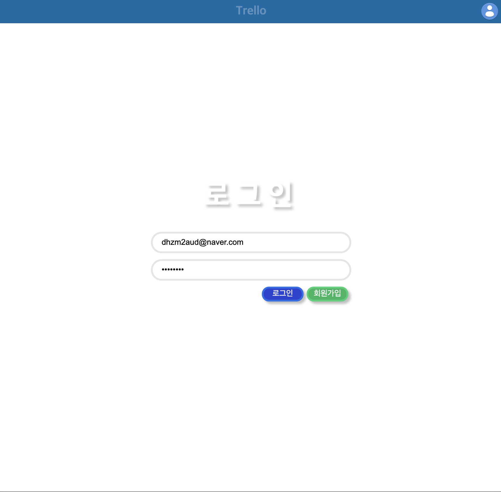
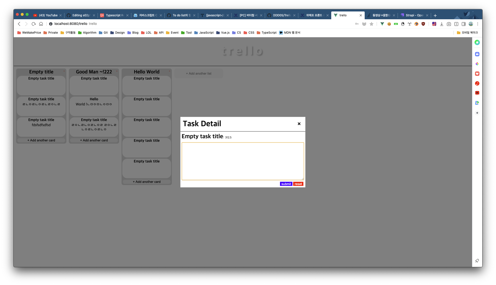

# trello_clone

> 트렐로 클론 (토이 프로젝트)

## Overview

-   node.js
-   vue.js
-   CMS(strapi)

## Prerequisites

Make sure you have installed all of the following prerequisites on your development machine:

-   Git - [Download & Install Git](https://git-scm.com/downloads). OSX and Linux machines typically have this already installed.
-   Node.js - [Download & Install Node.js](https://nodejs.org/en/download/) and the npm package manager. If you encounter any problems, you can also use this [GitLab Issue](https://lab.ssafy.com/webmobile1-sub1/s02p11d152/issues) to install Node.js.
-   StrAPI - [strapi.io](https://strapi.io/) CMS.

## Setup & Build

프로젝트 클론

```bash
$ git clone https://github.com/DDD05/Trello_web.git
```

### FE

패키기 설치

```bash
$ cd Trello_web
$ npm i
```

프로젝트 빌드

```bash
$ npm run build
```

### Server

서버를 설치

```bash
$ cd Trello_web/mock_server
$ npm i
```

## Run

### Vue

Front project 실행

```bash
$ cd Trello_web
$ npm run serve
```

### Server

CMS 서버 실행

```bash
$ cd Trello_web/mock_server
$ npm start
```

## 디자인



